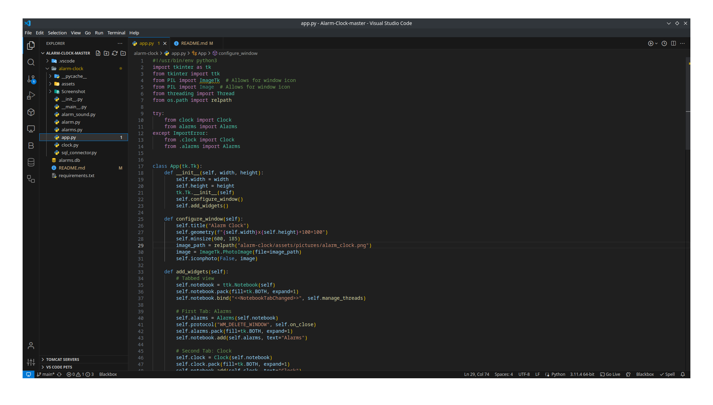
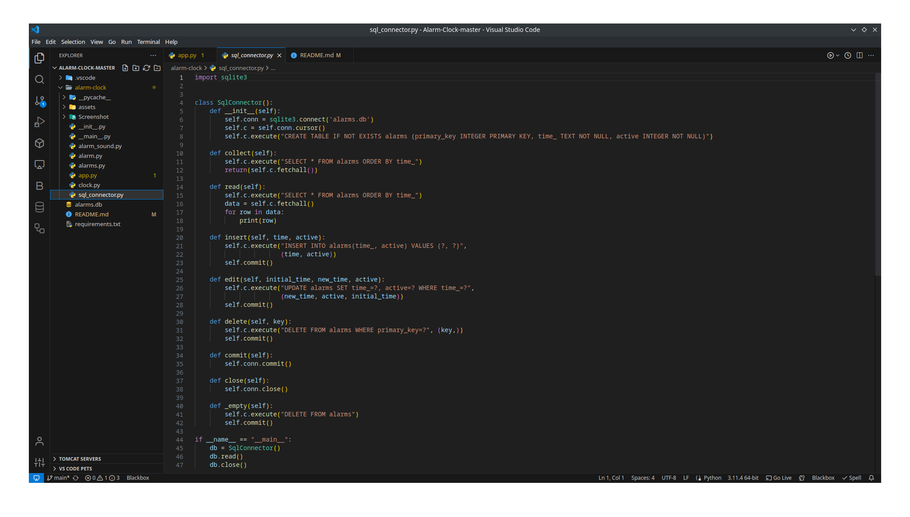
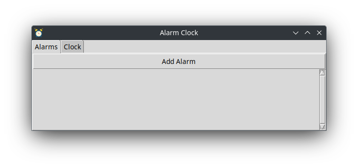
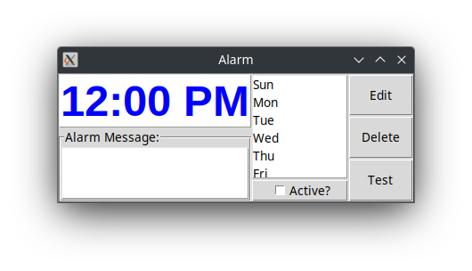
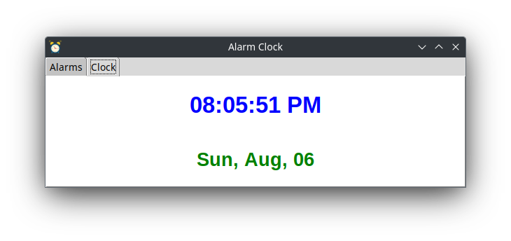

# Alarm-Clock
Tkinter GUI project for timekeeping

A simple alarm clock GUI project that I worked on to improve coding habits,improve my knowledge of tkinter and pygame modules, and utilize a database. When complete, this will be a fully functioning program similar to the "Clock" app on Android or its iOS equivalent. It has support for a local digital clock and alarms at the moment. Further improvements to the alarms is my next task. I seek to add customizable messages, sounds, and repeat settings.

## Alarms
You can set alarms to go off at whatever time you set. You can also deactivate the alarm so it will not go off.

## Clock
This digital clock shows the current local time in HH:MM:SS format.

## How to Use (From Source Code)
To run the source code, Python 3.8 or newer and pip must be installed. Then, you can clone the repository or download it as a zip file and extract it. Navigate to the root folder "Alarm-Clock" in Command Prompt or Terminal. Then, after creating a virtual environment (or you can just use regular pip), run the command `pip3 install -r REQUIREMENTS.txt`, or if that doesn't work, `pip install -r REQUIREMENTS.txt`. 

### Full Program
To run the full program, after having the latest stable version of Python 3 installed and the repository cloned or downloaded, navigate to the root folder of the repository "Alarm-Clock", then run the command `python -m alarm-clock` if on Windows, or `python3 -m alarm-clock` if on Mac or Linux.

### Digital Clock
To run the digital clock program, after having the latest stable version of Python 3 installed and the repository cloned or downloaded, navigate to the root folder of the repository "Alarm-Clock", then run the command `python alarm-clock\clock.py` if on Windows, or `python3 alarm-clock/clock.py` if on Linux or Mac.

### Alarms
To run the alarms program, after having the latest stable version of Python 3 installed and the repository cloned or downloaded, navigate to the root folder of the repository "Alarm-Clock", then run the command `python alarm-clock\alarms.py` if on Windows, or `python3 alarm-clock/alarms.py` if on Linux or Mac.